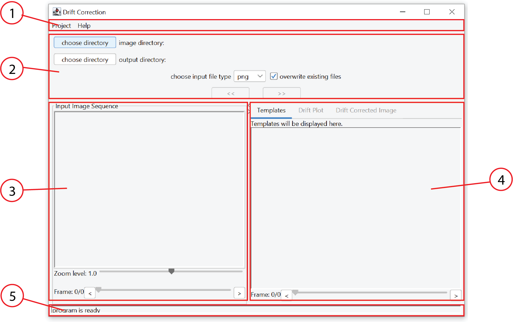
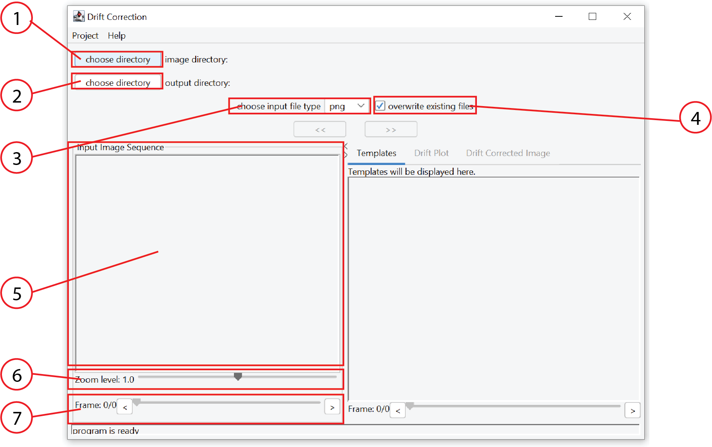
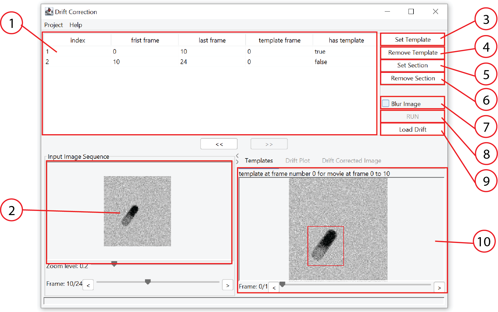
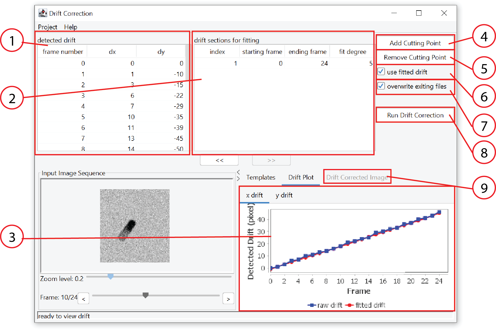

# drift correction tool

This software is developed perform drift correction for image sequences. 

### supported formats
* png
* jpg/jpeg
* bmp

### how to use
Drift correction can be 
* Overview

1. Menu bar for more setting options
2. Setting panel for user input. Use ">>" and "<<" buttons to navigate between different steps. ">>" option will becomes enabled once necessary requirements are met.
3. Input image sequence is displayed here.
4. Intermediate and final output images are displayed here.
5. Status panel for useful information.

* Set Input/Output Options

1. Select the location of input images. Alternatively, user can also drag and drop the folder to the setting panel. There must be at least two files
2. 
3. This should be chosen before setting input directory.
4. If selected, existing files in the output directory might be overwritten. See file structure for more details
5. The input image sequence is displayed here.
6. Use this panel to adjust magnification level of the image
7. Use the panel to navigate to different frames of the input image sequence
* Template Matching

* Drift Editing and Drift Correction

* Advanced Setting

### instruction
compile source code

### dependency
* 